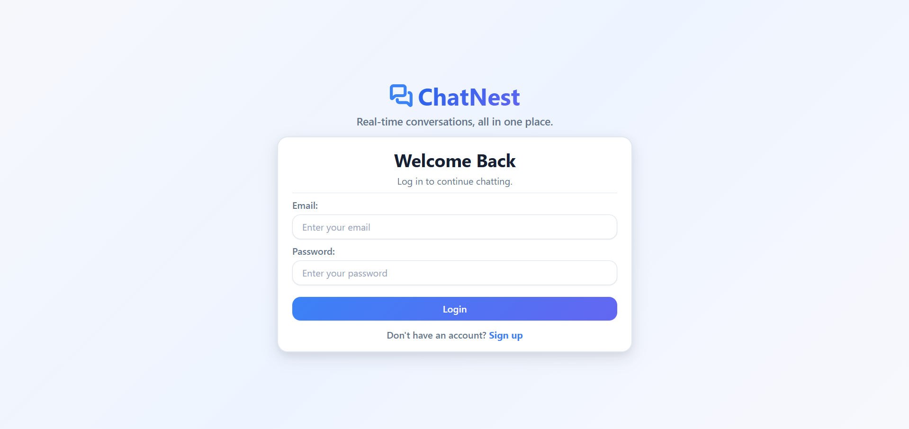
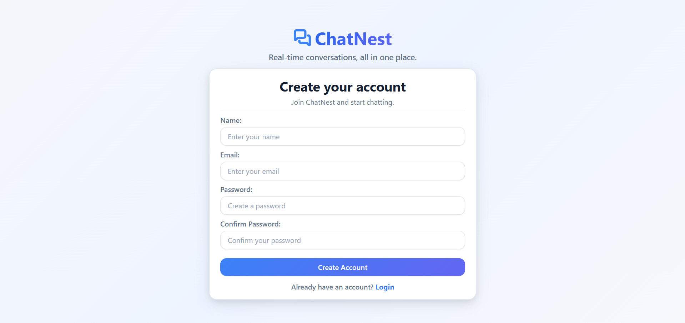
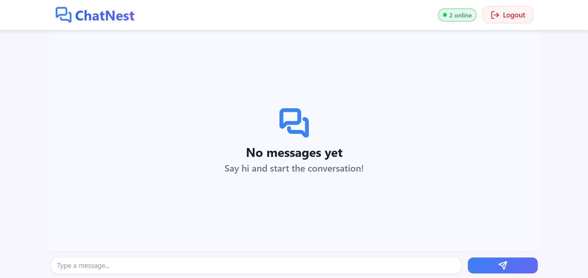
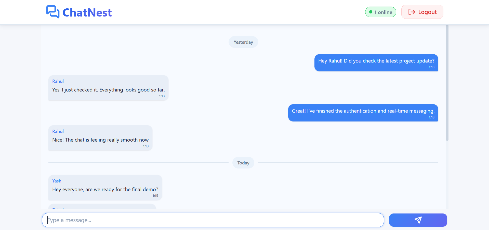
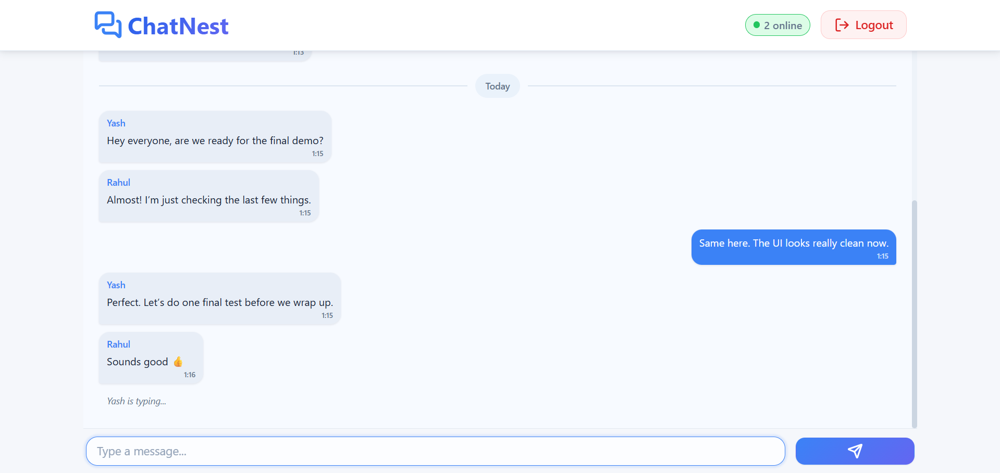
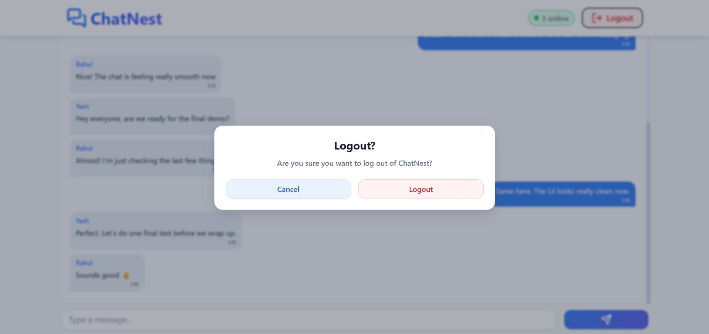

# 💬 ChatNest

A modern, responsive, real-time chat application built with **React.js and Firebase**.

ChatNest allows authenticated users to create an account, log in securely, and participate in a real-time global conversation. The application includes real-time messaging, online user presence, typing indicators, message timestamps, date separators, authentication, protected routes, and a responsive user interface.

---

## 🚀 Live Demo

🔗 **Live Demo:** [link_here]

---

## 📸 Screenshots

### Login


### Signup


### Chat Interface




### Logout Confirmation


---

## ✨ Features

- 🔐 User registration and login
- 👤 Firebase Authentication
- 💬 Real-time messaging
- ⚡ Instant message updates
- 🟢 Real-time online user count
- ✍️ Real-time typing indicators
- 🕐 Message timestamps
- 📅 Automatic date separators
- 🔒 Protected chat route
- 🚪 Logout confirmation modal
- 🔄 Authentication state persistence
- 📱 Responsive design
- 🎨 Clean and modern UI
- ⚡ Loading states and feedback
- 🛡️ Firebase security rules
- 🧩 Reusable React components

---

## 🛠️ Tech Stack

### Frontend

- React.js
- React Router
- JavaScript (ES6+)
- CSS3
- Lucide React

### Backend / Services

- Firebase Authentication
- Cloud Firestore
- Firebase Realtime Database

### Development Tools

- Vite
- npm
- Git
- GitHub

---

# 🔥 Firebase Services

ChatNest uses multiple Firebase services, with each service handling a specific responsibility.

### Firebase Authentication

Firebase Authentication manages:

- User registration
- Email/password login
- Logout
- Authentication state
- User identity
- Display names

Each authenticated Firebase user receives a unique `uid`, which is used throughout the application to identify users.

---

### Cloud Firestore

Cloud Firestore is used for storing chat messages.

Messages are stored in the:

```text
messages
```

collection.

Each message contains information similar to:

```text
{
  text: "Hello!",
  senderId: "firebase-user-id",
  senderName: "User Name",
  timestamp: serverTimestamp()
}
```

Firestore provides real-time listeners so that new messages can appear immediately without manually refreshing the page.

---

### Firebase Realtime Database

Firebase Realtime Database is used for temporary real-time application state.

ChatNest uses it for:

- User presence
- Online user count
- Typing indicators

The database structure is approximately:

```text
presence/
    userId/
        online
        lastSeen

typing/
    userId/
        typing
        name
```

Firestore is therefore responsible for **persistent chat messages**, while Realtime Database handles **short-lived real-time states**.

---

# 🔐 Authentication Flow

ChatNest uses Firebase Authentication with email and password.

### Signup Flow

The signup process works as follows:

```text
User enters name, email and password
            ↓
Client-side validation
            ↓
Firebase createUserWithEmailAndPassword()
            ↓
Firebase creates user account
            ↓
updateProfile() stores display name
            ↓
Firebase authentication state updates
            ↓
User is redirected to ChatNest
```

The application validates:

- Name
- Email
- Password
- Confirm password
- Minimum password length
- Password matching

Firebase authentication errors are converted into user-friendly messages using a centralized authentication error handler.

---

### Login Flow

```text
User enters email and password
            ↓
Client-side validation
            ↓
Firebase signInWithEmailAndPassword()
            ↓
Firebase verifies credentials
            ↓
AuthContext receives authenticated user
            ↓
User is redirected to "/"
```

---

### Authentication State

The application uses a custom `AuthContext`.

The context listens to Firebase's authentication state:

```text
onAuthStateChanged()
```

This allows the application to know whether a user is currently authenticated.

The context exposes:

```text
user
loading
```

through the `useAuth()` hook.

This prevents protected pages from rendering before Firebase finishes checking the user's authentication state.

---

# 💬 Real-Time Message Flow

Messages are stored in Cloud Firestore.

When a user sends a message:

```text
User types message
        ↓
MessageInput component
        ↓
Client-side validation
        ↓
sendMessage()
        ↓
Firestore messages collection
        ↓
onSnapshot() detects database update
        ↓
MessageList receives updated messages
        ↓
React updates the UI
```

The application uses Firestore's:

```text
onSnapshot()
```

listener to subscribe to the messages collection.

Messages are ordered chronologically using:

```text
orderBy("timestamp", "asc")
```

This means users receive new messages in real time without refreshing the application.

---

## Message Structure

Each message contains:

```text
text
senderId
senderName
timestamp
```

The sender's Firebase `uid` is stored with every message.

This allows the UI to determine whether a message belongs to the current user.

For example:

```text
message.senderId === user.uid
```

If true, the message is displayed as the user's own message.

---

# 🟢 Presence System

ChatNest includes a real-time online user counter.

Firebase Realtime Database is used to maintain user presence.

When an authenticated user enters the chat:

```text
ChatHome
    ↓
setUserOnline()
    ↓
Realtime Database
    ↓
presence/{userId}
    ↓
online: true
```

The application also uses:

```text
.info/connected
```

to determine whether the client is connected to Firebase.

Firebase's `onDisconnect()` functionality is used to automatically mark a user offline when their connection is lost.

Example presence data:

```text
presence/
    abc123/
        online: true
        lastSeen: timestamp
```

---

## Online User Count

The application subscribes to the entire `presence` node.

It then counts users whose:

```text
online === true
```

The resulting number is displayed in the navigation bar:

```text
● 5 online
```

This count updates automatically when users join or leave.

---

## Logout Presence Handling

Before logging out, ChatNest explicitly marks the current user offline:

```text
setUserOffline(user.uid)
```

After that, Firebase Authentication signs the user out.

This helps keep the online user count accurate.

---

# ✍️ Typing Indicator Flow

Typing indicators are implemented using Firebase Realtime Database.

When a user starts typing:

```text
User types
    ↓
MessageInput detects change
    ↓
setUserTyping()
    ↓
typing/{userId}
    ↓
typing: true
```

Other connected users listen to the typing node using:

```text
onValue()
```

The application filters out the current user and displays the remaining typing users.

For one user:

```text
Rahul is typing...
```

For two users:

```text
Rahul and Priya are typing...
```

For more users:

```text
Rahul, Priya and 3 others are typing...
```

---

## Typing Timeout

The application uses a timeout to automatically stop the typing state.

If the user stops typing for approximately 1.5 seconds:

```text
typing: false
```

is written to the database.

Typing is also cleared when:

- A message is sent
- The component is unmounted
- The user changes authentication state

This prevents stale typing indicators from remaining visible.

---

# 🧭 Routing

ChatNest uses **React Router** for client-side navigation.

The application contains the following main routes:

```text
/login
/signup
/
```

---

## Public Routes

### `/login`

Displays the login page.

### `/signup`

Displays the account creation page.

---

## Protected Route

The chat page is protected using:

```text
ProtectedRoute
```

The route structure is:

```text
ProtectedRoute
      ↓
Check authentication
      ↓
User authenticated?
   ↙          ↘
 Yes           No
  ↓             ↓
ChatHome      /login
```

If Firebase is still checking authentication, a loading screen is displayed.

If no authenticated user exists, the user is redirected to:

```text
/login
```

If the user is authenticated, the requested protected page is rendered through:

```text
<Outlet />
```

---

## Unknown Routes

Unknown routes are handled using:

```text
<Route path="*" element={<Navigate to="/" replace />} />
```

This redirects invalid application routes back to the main application route.

---

# 🛡️ Firebase Security Rules

ChatNest uses Firebase Security Rules to restrict database access to authenticated users.

---

## Firestore Rules

The message collection allows access only when the request is authenticated.

```text
rules_version = '2';

service cloud.firestore {
  match /databases/{database}/documents {

    match /messages/{messageId} {
      allow read, write: if request.auth != null;
    }
  }
}
```

This means unauthenticated users cannot read or write chat messages.

---

## Realtime Database Rules

Presence and typing information are also protected.

```text
{
  "rules": {
    "presence": {
      ".read": "auth != null",
      "$uid": {
        ".write": "auth != null && auth.uid === $uid"
      }
    },

    "typing": {
      ".read": "auth != null",
      "$uid": {
        ".write": "auth != null && auth.uid === $uid"
      }
    }
  }
}
```

These rules ensure that:

- Only authenticated users can read presence information.
- Only authenticated users can read typing information.
- A user can only modify their own presence data.
- A user can only modify their own typing data.

The `$uid` rule is important because it prevents one authenticated user from directly modifying another user's presence or typing state.

---

# 📁 Project Structure

```text
src/
│
├── components/
│   ├── auth/
│   │   ├── AuthButton.jsx
│   │   ├── AuthInput.jsx
│   │   └── AuthLayout.jsx
│   │
│   ├── chat/
│   │   ├── ChatNavbar.jsx
│   │   ├── DateDivider.jsx
│   │   ├── MessageBubble.jsx
│   │   ├── MessageEmptyState.jsx
│   │   ├── MessageInput.jsx
│   │   └── MessageList.jsx
│   │
│   └── common/
│       ├── Button.jsx
│       ├── ConfirmModal.jsx
│       └── Loader.jsx
│
├── context/
│   └── AuthContext.jsx
│
├── firebase/
│   ├── auth.js
│   ├── authErrors.js
│   ├── chat.js
│   ├── database.js
│   ├── firebase.js
│   ├── presence.js
│   └── typing.js
│
├── pages/
│   ├── ChatHome.jsx
│   ├── Login.jsx
│   └── Signup.jsx
│
├── routes/
│   └── ProtectedRoute.jsx
│
├── utils/
│   └── dateUtils.js
│
├── App.jsx
├── main.jsx
└── index.css
```

---

# 🎨 UI and Design

ChatNest uses a clean and modern interface focused on readability and simplicity.

The interface includes:

- Consistent color variables
- CSS custom properties
- Reusable button styles
- Responsive spacing
- Rounded message bubbles
- Authentication cards
- Loading states
- Confirmation modals
- Online status indicators
- Typing indicators
- Date separators
- Custom scrollbar styling

The application uses CSS variables for colors, spacing, typography, shadows, border radii, and transitions.

This makes the design easier to maintain and modify.

---

# 📅 Message Date Formatting

Messages are grouped visually using date separators.

The application displays:

```text
Today
```

for messages sent today.

For the previous day:

```text
Yesterday
```

For older messages:

```text
21 Aug 2026
```

Message times are displayed separately using the user's local time format.

Example:

```text
Hello everyone!
2:45 PM
```

---

# 📜 Automatic Message Scrolling

The message list uses a reference to the bottom of the conversation.

When new messages arrive, ChatNest automatically scrolls toward the latest message when the user is already near the bottom of the conversation.

This prevents the application from unnecessarily forcing the user to the bottom when they are intentionally reading older messages.

The application tracks the user's distance from the bottom of the message container to determine whether automatic scrolling should occur.

---

# ⏳ Loading States

ChatNest includes loading states for important asynchronous operations.

Examples include:

- Firebase authentication initialization
- Login
- Signup
- Sending messages
- Logout

Reusable loader components and loading buttons are used to provide visual feedback while operations are in progress.

---

# 🚪 Logout Flow

Logout requires confirmation before the user is signed out.

The flow is:

```text
Click Logout
      ↓
Confirmation modal
      ↓
User confirms
      ↓
Set user offline
      ↓
Firebase signOut()
      ↓
Authentication state updates
      ↓
ProtectedRoute redirects to /login
```

This reduces accidental logout actions and keeps the presence system synchronized.

---

# ⚙️ Installation

## 1. Clone the Repository

```bash
git clone https://github.com/codewithyashsoni/chat-nest.git
```

Navigate into the project:

```bash
cd chat-nest
```

---

## 2. Install Dependencies

```bash
npm install
```

---

## 3. Create a Firebase Project

Create a project in the Firebase Console and enable the following services:

- Authentication
- Cloud Firestore
- Realtime Database

For Authentication, enable:

```text
Email/Password
```

---

## 4. Create Firebase Web App

Create a Web App inside your Firebase project and obtain the Firebase configuration values.

---

## 5. Configure Environment Variables

Create a `.env` file in the project root.

```env
VITE_FIREBASE_API_KEY=your_api_key
VITE_FIREBASE_AUTH_DOMAIN=your_auth_domain
VITE_FIREBASE_PROJECT_ID=your_project_id
VITE_FIREBASE_STORAGE_BUCKET=your_storage_bucket
VITE_FIREBASE_MESSAGING_SENDER_ID=your_messaging_sender_id
VITE_FIREBASE_APP_ID=your_app_id
VITE_FIREBASE_DATABASE_URL=your_database_url
```

Do not commit the `.env` file to GitHub.

Make sure `.env` is included in `.gitignore`.

---

## 6. Configure Firestore

Create a Firestore database and configure the required security rules.

Use the Firestore rules provided in the **Firebase Security Rules** section of this README.

---

## 7. Configure Realtime Database

Create a Firebase Realtime Database and configure the presence and typing security rules.

---

## 8. Run the Development Server

```bash
npm run dev
```

The application will be available through the local development URL shown by Vite.

---

# 🚀 Production Build

To create a production build:

```bash
npm run build
```

To preview the production build locally:

```bash
npm run preview
```

---

# 🔐 Environment Variables and Security

Firebase configuration values are loaded using Vite environment variables.

Example:

```javascript
import.meta.env.VITE_FIREBASE_API_KEY
```

The Firebase Web configuration itself is not considered a secret credential. However, sensitive project configuration and development environment files should still not be committed unnecessarily.

The actual protection of application data is handled by Firebase Authentication and Firebase Security Rules.

Never place private service-account credentials or Firebase Admin SDK credentials in the frontend application.

---

# 🔮 Future Improvements

The current version focuses on a global real-time chat experience. Several features could be added in future versions.

### 👤 User Profiles

- Profile pictures
- Profile editing
- User status
- User information

### 💬 Private Messaging

- One-to-one conversations
- Private chat rooms
- Conversation list
- Unread message counts

### 👥 Group Chats

- Create groups
- Add/remove members
- Group administrators
- Group information

### 📎 Media Sharing

- Image sharing
- File attachments
- Image previews
- Firebase Storage integration

### 🔔 Notifications

- Browser notifications
- New message notifications
- Mention notifications
- Notification preferences

### 🗑️ Message Management

- Edit messages
- Delete messages
- Reply to messages
- Message reactions

### 🔍 Search

- Search messages
- Search users
- Search conversations

### 🌓 Theme Support

- Dark mode
- Light mode
- User theme preferences

### 🟢 Advanced Presence

- Last seen
- Custom online status
- Away status
- Offline status

### 🔒 Enhanced Security

- More granular Firestore validation
- Message ownership rules
- Server-side validation
- Rate limiting
- Abuse prevention

---

# 🎯 What This Project Demonstrates

ChatNest demonstrates practical knowledge of modern frontend development and Firebase-based real-time applications.

### React Development

The project demonstrates:

- Functional components
- React hooks
- `useState`
- `useEffect`
- `useRef`
- Context API
- Component composition
- Reusable components

### State Management

Application authentication state is managed through React Context.

Local component state is used for:

- Forms
- Messages
- Loading states
- Typing indicators
- Modal visibility
- Online user count

### Real-Time Application Development

The project demonstrates real-time data synchronization using:

- Firestore `onSnapshot`
- Realtime Database `onValue`
- Firebase presence
- Firebase `onDisconnect`

### Authentication

The project demonstrates:

- User registration
- Login
- Logout
- Authentication state persistence
- Protected routes
- Authentication error handling

### Database Design

The project demonstrates the use of two Firebase database solutions for different purposes:

```text
Cloud Firestore
        ↓
Persistent chat messages

Realtime Database
        ↓
Presence + typing state
```

### Routing

The project demonstrates:

- Public routes
- Protected routes
- Route redirection
- Authentication-aware navigation

### UI/UX

The project demonstrates:

- Responsive layouts
- Loading states
- Empty states
- Confirmation dialogs
- Error messages
- Hover and active states
- Real-time status indicators
- Automatic scrolling
- Date-based message grouping

### Security

The project demonstrates basic frontend application security through Firebase Authentication and database security rules that restrict access to authenticated users.

---

# 🧠 Architecture Overview

The overall application architecture can be summarized as:

```text
                         ┌──────────────────┐
                         │      React       │
                         │    Frontend      │
                         └────────┬─────────┘
                                  │
                ┌─────────────────┼─────────────────┐
                │                 │                 │
                ▼                 ▼                 ▼
        ┌──────────────┐  ┌──────────────┐  ┌──────────────┐
        │   Firebase   │  │   Firestore  │  │  Realtime    │
        │     Auth     │  │   Messages   │  │   Database   │
        └──────────────┘  └──────────────┘  └──────┬───────┘
                                                   │
                                          ┌────────┴────────┐
                                          │                 │
                                          ▼                 ▼
                                      Presence          Typing
```

---

# 📌 Key Design Decisions

### Firestore for Messages

Firestore was selected for chat messages because it provides:

- Structured document storage
- Real-time listeners
- Querying
- Ordering
- Scalable data access

### Realtime Database for Presence and Typing

Realtime Database is well suited for rapidly changing temporary states such as:

- Online/offline status
- Typing status
- Connection state

Separating these responsibilities keeps the architecture simple and appropriate for each Firebase service.

### React Context for Authentication

Authentication state is shared across the application using Context API rather than passing the authenticated user through multiple component levels.

### Reusable Components

Common UI elements such as:

```text
Button
Loader
ConfirmModal
AuthInput
AuthButton
```

are implemented as reusable components.

This reduces duplication and makes the application easier to maintain.

---

# 📈 Project Highlights

Some of the important implementation details include:

- Real-time Firestore message synchronization
- Real-time online user counter
- Firebase `onDisconnect()` presence handling
- Real-time typing indicators
- Authentication-aware routing
- Protected chat page
- Automatic message scrolling
- Date-based message separators
- Reusable component architecture
- Centralized authentication error handling
- Environment-based Firebase configuration
- Firebase database security rules
- Responsive CSS architecture
- Modern and minimal UI

---

# 👨‍💻 Author

**Yash Soni**

B.Tech Computer Science & Engineering

---

# 📄 License

This project was developed as a personal/project portfolio application for learning and demonstrating modern web development, React, Firebase, authentication, routing, and real-time application architecture.
